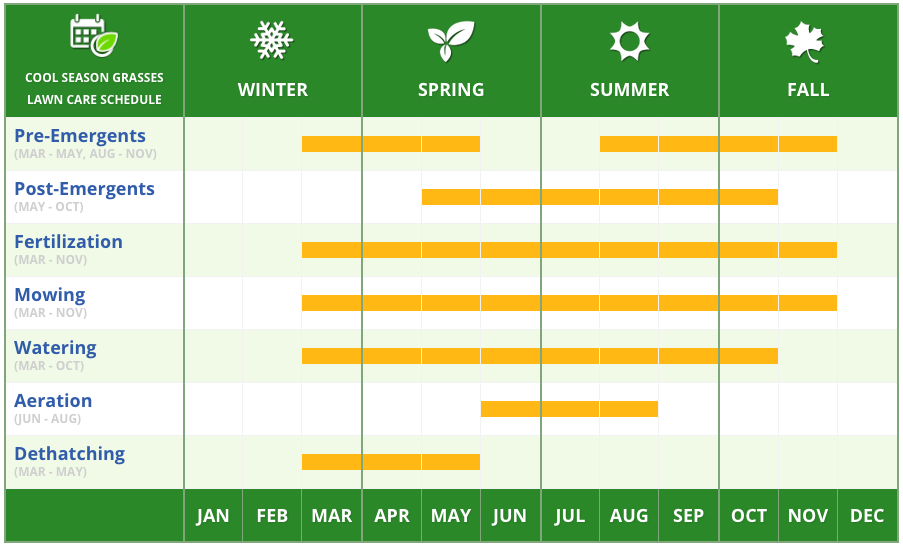

# This is Matt's awesome website

Also, text


## Here's a subsection

With text!

Or even, code:
```{r}
rnorm(10)
```

## Links to other websites

Let's link to useful tools for data science

[Google](https://www.google.com)

[P8105](https://www.p8105.com)

## Local image

Here's a seasonal guide to landscaping



## Link to page within the site

[About me](about.html)